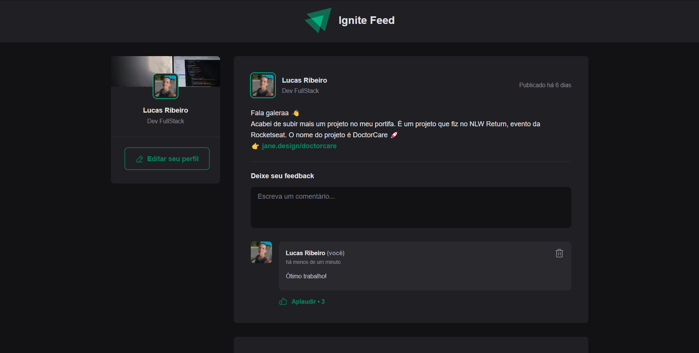

<h1 align="center">Ignite Feed</h1>

Projeto desenvolvido durante estudos sobre Fundamentos básicos de ReactJs com a Rocketseat. Ignite Feed é uma rede social onde o usuário pode fazer publicações, receber comentários e curtir postagens.



<br/>

# 🚀Tecnologias usadas

- ReactJs
- JavaScript
- CSS Modules
- data-fns
- Vite
- Git e Github

<br/>

# 👉 Features

- Criar comentário
- Apagar comentário
- Validar formulário
- Formatar datas com Date-fns 

<br/>

# 👨‍💻 Date-fns

Date-fns é uma biblioteca de datas para o JavaScript. Foi importante para formatar datas nesse projeto. Você pode ver ela sendo aplicada dentro da pasta Utils do repositório.

Documentação: [Docs-Date-fns](https://date-fns.org)

Aplicação básica de formatação de datas com o date-fns: 
````
  format(new Date(), "'Today is a' eeee")
  //=> "Today is a Saturday"
````